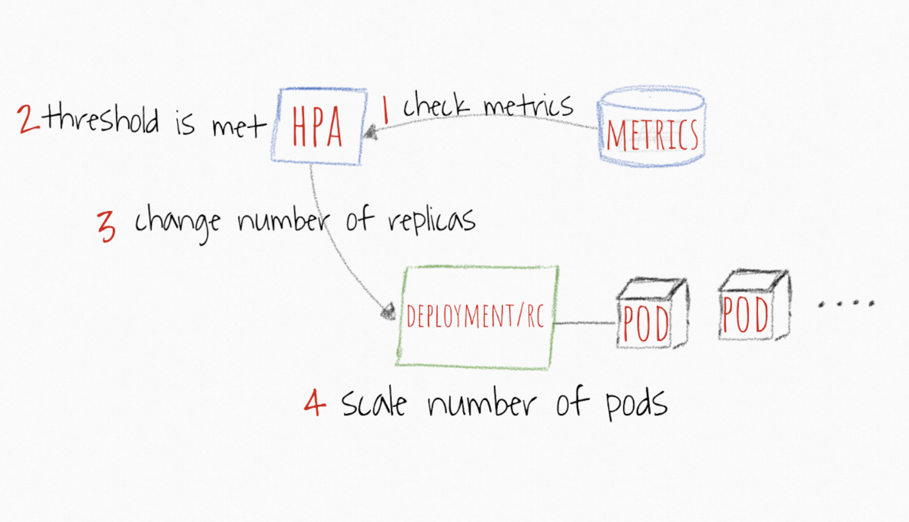

# Workshop 08 - Horizontal Pod Autoscaling (HPA)


# Index
* [Kubernetes Autoscaling Building Blocks](#kubernetes-autoscaling-building-blocks)
* [How does the Horizontal Pod Autoscaler work?](#How-does-the-Horizontal-Pod-Autoscaler-work)
  * [Exercise: HPA](#Exercise:-HPA)

---

Effective kubernetes auto-scaling requires coordination between two layers of scalability: (1) Pods layer autoscalers, this includes Horizontal Pod Autoscaler (HPA) and Vertical Pod Autoscaler (VPA)(aka. "rightsizing" or "autopilot"); both scale available resources for your containers, and (2) cluster level scalability, which managed by the Cluster Autoscaler (CA); it scales up or down the number of nodes inside your cluster.

**Note** this workshop focus only HPA.

---

[Back to Index](#index)

---

# How does the Horizontal Pod Autoscaler work?

The Horizontal Pod Autoscaler automatically scales the number of pods in a replication controller, deployment or replica set based on observed CPU utilization (or, with custom metrics support, on some other application-provided metrics).

The Horizontal Pod Autoscaler is implemented as a Kubernetes API resource and a controller. The resource determines the behavior of the controller. The controller periodically adjusts the number of replicas in a replication controller or deployment to match the observed average CPU utilization to the target specified by user.



 1. HPA continuously checks metrics values you configure during setup AT A DEFAULT 30 SEC intervals
 2. HPA attempts to increase the number of pods If the SPECIFIED threshold is met
 3. HPA mainly updates the number of replicas inside the deployment or replication controller
 4. The Deployment/Replication Controller WOULD THEN roll-out ANY additional needed pods

# Exercise: HPA
**Objectives:** Learn how to use the horizontal pod autoscaling feature and how to configure grafana to fetch pod/node metrics.

1) Start `minikube` with 4 cpu's and 4GB of memory
**Note** the params specified to configure the behavior of the controller manager.

**Command**

```sh
$ minikube start --cpus=4 --memory 4096 \
  --extra-config=controller-manager.horizontal-pod-autoscaler-downscale-stabilization=5s \
  --extra-config=controller-manager.horizontal-pod-autoscaler-sync-period=5s
```

2) Check heapster and metrics server are enabled

**Command**
```sh
$ minikube addons list | grep enabled
```

3) Check metrics pods are running

**Command**
```sh
$ kubectl get pods --namespace=kube-system | grep heapster
$ kubectl get pods --namespace=kube-system | grep metrics-server
```

4) Check heapster is connected to influxDB

**Command**
```sh
$ kubectl logs -n kube-system $(kubectl get -n kube-system pod --selector=k8s-app=heapster -o jsonpath='{.items..metadata.name}') | grep "k8s"
```

5) Check cpu and mem allocation

**Command**
```sh
$ kubectl describe nodes
$ kubectl top node
$ kubectl top pod -n kube-system
```

6) Open grafana 

**Command**
```sh
$ minikube addons open heapster
```

7) configure grafana UI (optional)

- https://grafana.com/dashboards/3646
- https://grafana.com/dashboards/3649

8) Check previous values (request, usage) in Grafana

9) Deploy example app

**Command**

```sh
kubectl apply -Rf workshop-08/manifests/app
```

10) wait until pod is Running (1 replica is running)

**Command**

```sh
kubectl get pods --show-labels --watch
```

11) Deploy HPA

**Command**

```sh
kubectl apply -f workshop-08/manifests/hpa/hpa.yaml
```

12) open new tab and run the following

**Command**

```sh
$ kubectl get hpa -w
```

13) open new tab and run the following (check 5 replicas running)

**Command**

```sh
$ kubectl get deployment php-apache -w
```

14) open new tab and run the following

**Command**

```sh
$ kubectl run --rm -i --tty load-generator --image=busybox /bin/sh
# run this
while true; do wget -q -O- http://php-apache.default.svc.cluster.local; done
```

15) Wait for the hpa to trigger (observe hpa and deployment)

16) Stop the loader and check how the deployment scales down to 5


---

[Back to Index](#index)

---


# Index
* [Application Introspection and Debugging](#Application-Introspection-and-Debugging)
  * [Exercise: kubectl top pod](#Exercise:-kubectl-top-pod)
* [Cluster-level monitoring](#Cluster-level-monitoring)
  * [Exercise: kubectl top node](#Exercise:-kubectl-top-node)
* [Cleaning up](#cleaning-up)
* [Helpful Resources](#helpful-resources)

---

# Application Introspection and Debugging

## Exercise: Debugging Pending Pods
**Objectives:** Learn how to use `kubectl describe pod` and `kubectl describe nodes` to troubleshoot app deployments.

A common scenario that you can detect using events is when you’ve created a Pod that won’t fit on any node. For example, the Pod might request more resources than are free on any node, or it might specify a label selector that doesn’t match any nodes. Let’s say we created the previous Deployment with 5 replicas (instead of 2) and requesting 600 millicores instead of 500, on a four-node cluster where each (virtual) machine has 1 CPU. In that case one of the Pods will not be able to schedule

---

1) Start off by deleting the deployment and checking the node status

**Command**
```sh
$ kubectl delete deployment nginx-deployment
```

**Command**
```sh
$ kubectl describe nodes
```

Understand `kubectl describe nodes` **output**


3) Deploy and scale up previous deployment

**Command**
```
$ kubectl apply -f workshop-07/manifests/nginx-with-request.yaml
$ kubectl scale deploy nginx-deployment --replicas 5
```

4) Check pod status via `kubectl get pods`, as follows:

**Command**
```
$ kubectl get pods --show-labels --watch
```
Observe **pending** status

3) Find out what's happening using `kubectl describe`, as follows:

**Command**
```
$ kubectl describe pod nginx-deployment-<ANY_PENDING_POD_ID>
```

Here you can see the event generated by the scheduler saying that the Pod failed to schedule for reason FailedScheduling (and possibly others). The message tells us that there were not enough resources for the Pod on any of the nodes.


---

[Back to Index](#index)

---
---

# Helpful Resources

* [VPA](https://github.com/kubernetes/community/blob/master/contributors/design-proposals/autoscaling/vertical-pod-autoscaler.md)
* [VPA](https://github.com/kubernetes/autoscaler/tree/master/vertical-pod-autoscaler)
* [cluster-autoscaler](https://github.com/kubernetes/autoscaler/tree/master/cluster-autoscaler)
* [kube-controller-manager](https://kubernetes.io/docs/reference/command-line-tools-reference/kube-controller-manager/)

---

[Back to Index](#index)

---